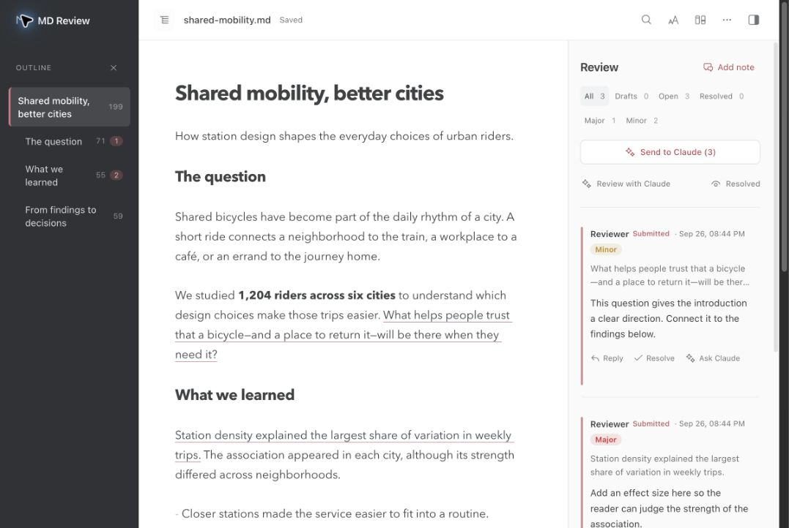

# MD Review

**Review Markdown the way you review a Word draft, then let an AI agent do the revisions.**

MD Review is a VS Code extension that opens any `.md` file in a clean, rendered view. You select text and leave comments. When you press **Submit review**, the comments are written to a small JSON file next to your document, where Claude, Codex, or any script can read them, edit the Markdown, reply in the thread, and mark it resolved. The view updates live while the agent works.



```
paper.md                   ← your document; comments never touch it
paper.md.comments.json     ← the comment threads (schema below)
```

**What you get**

- A reading view with tables, footnotes, KaTeX math, and images (including pandoc `{width=…}` sizes).
- Comments on any selection, with drafts, one-click **Submit review**, replies, and resolve/reopen.
- An agent protocol and a zero-dependency CLI, so any agent can find submitted comments and answer them.
- Light editing directly in the rendered view that **never re-serializes the file**. Only the bytes you changed are written, and line endings, spacing, and markup elsewhere stay exactly as they were.
- **Send to Claude**: one click hands the open threads to Claude Code in a terminal (or copies the prompt for any other agent).
- A **review inbox** in the Explorer: every thread in the workspace, grouped by whose turn it is.
- An outline pane, find in document, `j`/`k` jumps between comments, and status and author filters.
- Reading themes (Paper, Sepia, Dusk, Night), a serif option, and zoom for the document column.
- Byte-exact undo and redo of edits made in the view.
- A collapsible comments pane, keyboard access to the outline, reading panel, and threads, and a browser mode that runs without VS Code.

It was built for academic manuscripts, but works for any Markdown: docs, specs, notes, or READMEs.

## Install

**From a release (easiest).** Download `md-review-<version>.vsix` from the [Releases page](https://github.com/mustafaakben/md-review/releases), then either run

```bash
code --install-extension md-review-0.1.0.vsix
```

or, in VS Code, open the Extensions view, click **⋯** → **Install from VSIX…**, and pick the file. Reload the window afterwards. The same file works on Windows, macOS, and Linux, and in VS Code forks that accept `.vsix` files (Cursor, Windsurf, VSCodium).

**From source.** Requires Node.js 20 or newer.

```bash
git clone https://github.com/mustafaakben/md-review.git
cd md-review
npm install
npm run package          # builds md-review-<version>.vsix
code --install-extension md-review-*.vsix
```

## Use

**Opening a file.** MD Review never takes over `.md` files. Open it one of these ways:
- Right-click the file → **Open in MD Review**
- Use the comment icon in the editor title bar
- Run **Reopen Editor With… → MD Review**

Once open, the title-bar icon **Open Markdown Source** shows the raw file beside it.

To make MD Review the default for one project, add this to that folder's `.vscode/settings.json`:

```json
"workbench.editorAssociations": { "*.md": "mdReview.editor" }
```

**Commenting.**
- Select text, click **Comment**, type, and press **Save draft** (Ctrl+Enter, ⌘↩ on macOS). Or select text and press Ctrl+Alt+M (⌥⌘M) or `c` to go straight to the comment box.
- In the comment box, pick a kind: **Comment** (asks for a change), **Question** (asks for an answer, not an edit) or **Praise** (no action). Optionally mark it **Major**, **Minor** or **Nit** (Alt+1/2/3, ⌥1/2/3 on macOS). Plain comments look exactly as before.
- Selections snap to whole words, so a drag that stops mid-word quotes the whole word.
- **Suggest edit.** In the comment box, **Suggest edit** opens a "Replace with" box holding the selection. Rewrite it (or clear it to suggest deleting it) and save. The card shows the change as a small redline with **Apply**, which rewrites just that text in the file through the same checked path as typing in the view, then resolves the thread. Undo reverts it. If the quote spans blocks or sits next to math or citations, Apply opens the source instead.
- **Whole sections and the whole document.** Hover a heading and click the comment icon at its right to comment on that section. **Comment on document** in the comments pane is for notes about the whole file.
- The sidebar lists threads in document order, with whole-document threads first. Click a quote to jump to its text. Once some thread has a severity, Major/Minor/Nit chips filter by it.
- Each thread has Reply, Resolve/Reopen, and Delete. A draft is deleted at once; a submitted or resolved thread asks "Delete thread?" first, since deleting it removes its replies too and can't be undone.
- **Submit review (n)** flips every draft to `submitted` and stamps them all with one `submittedAt` time.
- The panel icon at the right end of the toolbar hides the comments pane, and **Comments** in the same spot brings it back. The choice is remembered, and clicking a highlighted comment in the text reopens the pane.

**Editing: seamless, no boxes.**
- Turn on **Edit** in the toolbar, then click anywhere in a paragraph, heading, list item, or table row and type. You can also double-click text, or use the pencil that appears in the left margin on hover.
- **Enter** or clicking away saves. **Esc** cancels.
- Bold/italic/link markup around your change is kept. For example, retyping a word inside `**Station function**` keeps the `**`.
- How it works: the host diffs the rendered text before and after your edit and maps the change onto the Markdown source. It re-renders the candidate and **writes only if the result shows exactly what you typed**. Only that block's source lines are rewritten, and every other byte (including CRLF/LF endings) is left alone.
- If a change can't be mapped with certainty (blocks with math, images, or code, or typing Markdown syntax), nothing is written. The raw Markdown for that block opens instead.
- **Alt+double-click** (Option+double-click on macOS) always opens the raw Markdown of a block.
- If the file changed on disk since it was rendered (say, Claude edited it), the edit is refused and the view refreshes.
- Ctrl+B/I/U (⌘B/I/U) are disabled while editing, since formatting isn't a text change. Use Alt+double-click (Option+double-click) to add markup.

**Undo.** Ctrl+Z (⌘Z) undoes your last edit in the view and Ctrl+Y or Ctrl+Shift+Z (⇧⌘Z) redoes it; the undo and redo arrows in the toolbar do the same. They grey out as soon as there is nothing to undo, including right after another program changes the file. Undo restores the exact bytes that were there before. If something else changed the file since (say, Claude), undo is refused rather than overwriting that change.

**Getting around.**
- **Outline** (the list icon at the left of the toolbar, or Ctrl+Shift+O / ⇧⌘O) lists the headings, follows your reading position, and shows how many open threads each section has. In narrow windows it slides over the document and closes after a jump.
- **Find** (Ctrl+F / ⌘F, or `/`) highlights every match in the document. Enter and Shift+Enter step through them; Esc closes.
- **Jump between comments** with `j` / `k` (or Alt+↓ / Alt+↑). `r` opens a reply on the current thread.
- **Filter threads** above the comment list by status (All, Drafts, Open, Resolved) and by author. An author filter also matches threads they replied to.

**Word counts and document health.**
- The toolbar shows the document's word count and reading time (at about 230 words a minute), and the outline shows each section's words, its heading and subsections included, so the top-level sections add up to the total. Only the prose counts: not code blocks, the front-matter card, footnotes, generated citations and references, or text CriticMarkup deletes. Inline code counts; a formula (with its equation number) or a web address counts as one word, an emoji on its own counts as a word, and Chinese and Japanese characters count one each. Counting happens while the view is idle, so it never delays opening or repainting a file, and after an edit only the changed blocks are counted again.
- Set targets in the front matter; section names match headings, ignoring case. A section over its target turns amber in the outline ("312 / 250 words" on hover), and so does the toolbar count when the whole document is over.

  ```yaml
  mdreview:
    words: { total: 8000, Abstract: 250, Discussion: 1500 }
  ```

  The flat form `mdreview: { total: 8000, abstract: 250 }` works too.
- The pulse icon in the toolbar opens **Document health**: relative links and images whose file is missing (checked only while the panel is open; in Restricted Mode only inside the document's folder and the workspace), unknown citation keys, an unreadable bibliography, unresolved cross-references, duplicate headings, sections over target, targets that name no heading, and orphaned comments (open ones; not resolved threads or ones whose suggested edit was applied). Click an item to jump to it. For an orphaned comment, select the passage it's about and press **Re-anchor to selection**. The badge on the icon counts the problems found so far.

**Reading view.** The **Aa** icon in the toolbar picks a theme for the document column (Match VS Code, which is the default, plus Paper, Sepia, Dusk, and Night), a Sans or Serif font, and the zoom. Zoom with Ctrl+mouse wheel (or a trackpad pinch), Ctrl+= and Ctrl+−, and reset with Ctrl+0 (⌘ instead of Ctrl on macOS). Zoom scales only the document, not the panels. Your choices are remembered across files and sessions.

**Send to Claude.**
- **Send to Claude** at the top of the comments pane submits your drafts and starts [Claude Code](https://claude.com/claude-code) in a new terminal with a prompt that tells it how to work through the open threads. **Ask Claude** on a card sends just that thread.
- While Claude works, the comments pane shows **Claude is working · 2 of 5** with a progress bar, and the thread Claude is on right now pulses in the document and the list. When every sent thread has an answer you get a summary, "Claude finished: 4 resolved, 1 question for you", with **Show questions** to jump to the threads that need you. If the panel is in the background, VS Code shows the summary as a notification.
- The prompt is always copied to the clipboard too, so you can paste it into any other agent.
- **See what Claude changed.** Send to Claude saves a copy of the file first. The **Changes** icon in the toolbar (or `]`) paints a redline over the view: inserted words are underlined and deleted words are struck through, in your theme's diff colours. Math, code, diagrams and tables are marked as changed as a whole, with **Show before** beside them. Each change has **Keep** and **Revert**. Revert puts the old lines back through the same checked, byte-exact path as your own edits, so Undo brings the change back, and it's refused if the file changed since the view was drawn. **Accept all** drops the copy. Edits you make in the view after sending are yours, so they don't show, unless they're inside a change Claude made. `]` and `[` step through the changes.
- Threads Claude resolved or answered get **Show change**, which jumps to the changes inside that thread's text. When Claude finishes, the summary says how many blocks changed, with **Review changes**.
- The copy is a file in the extension's workspace storage (in memory in browser mode), never next to your file; only its time and threads go in workspace state. If you send again before reviewing the last round's changes, the older copy stays, so nothing drops out of view. Each file has one copy, a workspace keeps at most 50 of them and 64 MB in all (the oldest go first), **Accept all** deletes it, and files over 4 MB get none (Send says so).
- Set `mdReview.agent.editMode` to `suggest` and Claude proposes a replacement on each thread instead of editing the file. Its suggestions show on the card with **Apply** and **Dismiss**, so nothing changes until you say so.
- `mdReview.agent.command` sets the program (default `claude`; extra arguments allowed, e.g. `claude --permission-mode acceptEdits`). Set `mdReview.agent.mode` to `clipboard` to only copy the prompt.
- In browser mode the button copies the prompt.
- **Send a whole folder.** Right-click a folder in the Explorer → **Send Open Reviews in Folder to Claude** (or run it from the Command Palette for the workspace). Claude gets the list of files with open threads and works through them one at a time with the CLI's `next` command, which shows each comment with the source lines its quote is on.
- **Review inbox.** The **MD Review** view in the Explorer lists the threads of every reviewed file in the workspace under **Needs you** (Claude replied, your turn), **From Claude, to triage** (drafts left by Review with Claude), **Waiting on Claude** (a spinning icon marks a thread Claude is working on), **Drafts**, and **Resolved**, each with a count. Click a thread to open its file in MD Review at that thread. **Send All to Claude** in the view's title bar starts Claude in each workspace folder that has open threads, in a terminal of its own (not offered in Restricted Mode), and once the view has been opened the status bar shows how many threads need you, counting Claude's drafts to triage. The view searches the workspace only when you first expand it (it skips `node_modules`, dot-folders, and `files.exclude`, and lists up to 2000 reviewed files); after that it reads just the sidecars that change, and searches again when a folder with reviewed files in it is deleted or renamed.
- **Claude Code skill.** Run **MD Review: Add Claude Code Skill to Workspace** once per project. It writes `.claude/skills/md-review/` (a short `SKILL.md` plus a copy of the CLI), so a Claude Code session in that folder knows the review loop when you just say "go through my review comments". From a terminal, `node cli/mdreview.mjs init-claude <folder>` does the same.

**Review with Claude.**
- **Review with Claude** in the toolbar (the sparkle, or **MD Review: Review with Claude** in the Command Palette) asks Claude to read the document first and leave comments for you, before you review it yourself. Pick a reviewer: **Copy edit**, **Clarity and flow**, **Methods reviewer**, **Claims need citations**, **Reviewer 2 (tough but fair)**, or **Custom…** to type one line of your own.
- Claude starts the same way as Send to Claude (a terminal, or the clipboard in browser mode). It leaves at most 12 comments (`mdReview.agent.reviewComments`), most important first, each with a severity and sometimes a suggested replacement. It doesn't edit the file.
- Its comments arrive as drafts under **From Claude** at the top of the comments pane, with their own filter chip, and dashed highlights in the text. Each has three buttons: **Keep** makes it your draft (it goes out with your review, noting Claude raised it), **Do it** keeps it and queues it for Claude (it's submitted, so the next **Send to Claude** hands it over with everything else you queued), and **Discard** deletes it. Submit review and Send to Claude leave untriaged drafts from Claude alone, and the draft count leaves them out.
- While Claude reviews, the comments pane shows **Claude is reviewing · 3 comments so far**. When Claude says it's done (the CLI's `review-done`), reaches the limit, or goes quiet for five minutes, it shows **Claude left 5 comments · 3 to triage** with **Show them**, and **All 5 of Claude's comments triaged** once you're through. A Send to Claude round started meanwhile gets its own row.
- Add your own reviewers as Markdown files in `.mdreview/reviewers/` in the workspace. The file name is the label (`House style.md` shows as "House style") and the content is the brief (the first 64 KB). The menu lists the files when it opens and reads only the one you pick; symlinks and anything that isn't a plain file are left out. Claude gets the brief as quoted material from whoever set up the workspace, under rules that keep it to leaving comments.

**Keyboard.** Press `?` in the view (or the keyboard icon in the toolbar) for the full list. Every shortcut uses the native keys on each platform: Ctrl on Windows and Linux, ⌘ on macOS, and Option (⌥) where Windows uses Alt. Toolbar tooltips show the keys for your platform. Rebind the Ctrl/⌘ shortcuts under **Keyboard Shortcuts** in VS Code (search for "MD Review"); the single-letter keys are fixed.

| Action | Windows / Linux | macOS |
| --- | --- | --- |
| Comment on the selected text | Ctrl+Alt+M or `c` | ⌥⌘M or `c` |
| Save a comment or reply | Ctrl+Enter | ⌘↩ |
| Reply to the current thread | `r` | `r` |
| Submit review | Ctrl+Shift+Enter | ⇧⌘↩ |
| Send to Claude | Ctrl+Alt+Enter | ⌥⌘↩ |
| Next / previous comment | Alt+↓ / Alt+↑, or `j` / `k` | ⌥↓ / ⌥↑, or `j` / `k` |
| Next / previous change | `]` / `[` | `]` / `[` |
| Find in document | Ctrl+F or `/` | ⌘F or `/` |
| Outline | Ctrl+Shift+O | ⇧⌘O |
| Comments pane | Ctrl+Alt+P | ⌥⌘P |
| Edit mode on / off | `e` | `e` |
| Undo / redo edit | Ctrl+Z / Ctrl+Y (or Ctrl+Shift+Z) | ⌘Z / ⇧⌘Z |
| Zoom in / out / reset | Ctrl+= / Ctrl+− / Ctrl+0 | ⌘= / ⌘− / ⌘0 |
| Keyboard shortcuts | `?` | `?` |

Single-letter keys work when you're not typing in a box. Tab reaches the toolbar, the outline, and the comments. In the outline, ↑/↓ move between headings, Enter jumps (and moves focus to that heading), and Esc closes it. In the reading panel, the arrow keys pick a theme or font and Esc closes it. Esc inside a text box or editor only closes that box.

**Live reload.** When Claude edits the `.md` or the sidecar, the view updates on its own.

**Word round-trip.** For reviewers who work in Word (an advisor, a co-author):
- **MD Review: Export to Word (with comments)** (Command Palette, or `…` in the MD Review title bar) writes `<file>.docx` next to the Markdown. Headings, lists, quotes, code, tables, links and local PNG/JPEG images come across; math appears as its TeX source and footnotes as `[n]`. Each open thread becomes a real Word comment on its quoted text, with the author and date; its kind and severity and any open suggested edit follow as a line in italics. Choose whether to add replies (as Word replies in the same thread) and resolved threads (marked resolved in Word). A document comment sits on the first paragraph; threads whose quote is gone are listed under **Unanchored comments** at the end. No pandoc or Word needed.
- **MD Review: Import Comments from Word…** reads a reviewed `.docx` and adds each Word comment as a draft thread by its author (`"origin": "word"`), placed on the same text in the Markdown. Word replies join their thread, comments resolved in Word stay resolved, and tracked changes (insertions and deletions) become threads with a suggested edit you can apply. A file exported by MD Review comes back with its kinds, severities and suggested edits. A comment whose text can't be found is added as a document comment that quotes it, so nothing is lost. Importing the same file twice adds nothing new.
- Import only reads the comment, reply and document parts of the `.docx`, and refuses files that are not plain Word documents: over 100 MB, parts that would inflate past 64 MB or that pack suspiciously well (ZIP bombs), ZIP64 or encrypted archives, and XML that declares a DTD (entity bombs and external entities). Entry names that point outside the archive are ignored.
- In Restricted Mode both work: export reads images and the bibliography only from the document's folder and the workspace and doesn't offer to open the `.docx` in another program; import reads the `.docx` you pick and writes only the comments file. The Word code loads when you first run one of these commands, not when MD Review starts.

**Settings.**
- `mdReview.author`: the name on your comments. If empty (the default), your system user name is used.
- `mdReview.showResolved`: whether resolved threads show in the sidebar.
- `mdReview.pollFiles`: check the file and its comments every 2 seconds while the view shows, for folders that don't report changes (network shares, some remote mounts). Network paths on Windows, including `\\wsl$`, are checked this way already; a network share mapped to a drive letter (like `Z:`) needs this setting.
- `mdReview.agent.command`, `mdReview.agent.mode`: what **Send to Claude** runs (see above).
- `mdReview.agent.reviewComments`: the most comments **Review with Claude** asks for (default 12).

## Browser mode (no VS Code)

The same viewer and editor also run in a browser, using the same host code:

```bash
npm run harness -- path/to/file.md [port]      # → http://127.0.0.1:4417/
```

It serves **only the file you pass**, and it edits that file for real, so point it at the file you want to review. By default it listens on localhost only. `--host <ip>` exposes it to other machines (for example over a VPN such as Tailscale). **There is no authentication:** anyone who can reach that address can read and edit the file, so never bind it to a public network.

## Sidecar schema (v1) — for agents

File: `<name>.md.comments.json`, UTF-8, 2-space JSON.

```jsonc
{
  "schemaVersion": 1,
  "file": "paper.md",                      // basename of the Markdown file (paths are relative; synced across machines)
  "comments": [
    {
      "id": "c_mf3k2x9a1b2c3",               // unique; keep as-is
      "author": "Reviewer",
      "createdAt": "2026-09-25T20:17:07.445Z",
      "anchor": {                            // W3C TextQuoteSelector-style anchor on the RENDERED text
        "quote": "a dock will be free at the end of a trip",
        "prefix": "riders must trust that ",   // up to 32 chars of rendered text before the quote
        "suffix": " (Rivera & Chen, 2021). Plan",// up to 32 chars after
        "lineStart": 11,                     // 1-based, inclusive: source lines of the block(s) containing the quote
        "lineEnd": 11                        //   (a hint for finding the source; may be stale after edits)
      },
      "body": "Add the page number for Rivera & Chen.",
      "status": "submitted",                 // "draft" | "submitted" | "resolved"
      "submittedAt": "2026-09-25T20:17:31.002Z",  // batch time of the Submit that sent it, else null
      "resolvedAt": null,                    // set when resolved, else null
      "reopenedAt": null,                    // optional: set when a resolved thread is reopened
      "kind": "question",                    // optional: "question" (answer, don't edit) | "praise" (no action); absent = a plain comment
      "severity": "major",                   // optional: "major" | "minor" | "nit"
      "scope": "section",                    // optional: "section" (quote is a heading; about the whole section) | "document" (empty quote)
      "workingAt": "…", "workingBy": "Claude", // optional: set by the CLI while an agent works on this thread
      "suggestion": { "text": "a dock is free" }, // optional: replacement for the quote ("" deletes it); gains appliedAt / dismissedAt
      "origin": "agent",                     // optional: "agent", a draft an agent left as first reviewer, not yet kept or dismissed;
                                             //   "word", imported from a Word document
      "reviewRun": "3f9a1c07",               // optional: the review run that left it (comment --run)
      "suggestedBy": "Claude",               // optional: who raised a thread the reviewer kept
      "replies": [
        { "id": "r_…", "author": "Claude", "createdAt": "…", "body": "Added p. 52." }  // a reply can carry a "suggestion" too
      ]
    }
  ],
  "reviewDoneAt": "2026-09-25T20:31:00.000Z", // optional: when an agent reviewing first said it was done (CLI review-done)
  "reviewDoneRun": "3f9a1c07"                 // optional: the review run it ended (review-done --run)
}
```

### Agent protocol

1. **Find work.** Look for comments with `"status": "submitted"` in any `**/*.md.comments.json`.
2. **Locate the text.**
   - `quote` is the rendered text, so Markdown markup is stripped. It won't grep-match source that has `**bold**`, link syntax, or `*italics*` inside the quote.
   - Start with `lineStart`–`lineEnd`, then search that area for the quote's words.
3. **Act.**
   - Work `major` before `minor` before `nit`. A `question` gets an answer in a reply and no edit. `praise` needs no change.
   - `scope: "section"` means the whole section under the quoted heading; `scope: "document"` means the whole file.
   - Edit the `.md` directly with minimal, targeted edits.
   - Add a reply with `"author": "Claude"`.
   - Set `"status": "resolved"` and `resolvedAt` when done. Or leave the comment `submitted` and ask a question in a reply.
   - Optional: while working on a thread, set `workingAt` (now) and `workingBy` on it, and remove both when you reply or resolve. The viewer then shows which thread you're on. The CLI does this for you.
4. **Write safely.**
   - Re-read the sidecar right before writing.
   - Change only the comments you touch, and keep every other field and comment as it is.
   - Never change `id`s. Don't delete other people's comments.
   - The viewer merges by re-reading on every write, so a quick read-modify-write is safe.
5. **Extra fields are kept.** MD Review and the CLI keep any field they don't know, on the file, on each comment, its anchor, and each reply. A tool can add its own data (for example `"x-tool": {…}`) without it being erased by the viewer's next write.
6. **Anchoring.** If your edit changes the quoted text itself, the comment may show as *orphaned* in the viewer. That's fine once it's resolved; the thread is kept.

### CLI (zero dependencies)

Paths can be `.md` files or folders; folders are searched recursively (skipping `node_modules` and hidden folders), and the default is the current folder.

```bash
node cli/mdreview.mjs summary [paths…]                       # open / draft / resolved counts per file
node cli/mdreview.mjs next    [paths…] [--all] [--json]      # the next open comment + the source lines its quote is on
node cli/mdreview.mjs context path/to/file.md <id> [--lines 2] [--json]
node cli/mdreview.mjs list    [paths…] [--status submitted] [--json]
node cli/mdreview.mjs show    path/to/file.md <id>
node cli/mdreview.mjs reply   path/to/file.md <id> "text" [--author Claude]
node cli/mdreview.mjs resolve path/to/file.md <id> ["closing reply"] [--author Claude]
node cli/mdreview.mjs suggest path/to/file.md <id> "replacement for the quote" ["note"]
node cli/mdreview.mjs reopen  path/to/file.md <id>
node cli/mdreview.mjs comment path/to/file.md --quote "text as it reads" [--line N] [--kind question|praise] [--severity major|minor|nit] [--suggest "replacement"] [--run id] "comment"
node cli/mdreview.mjs comment path/to/file.md --document "comment"
node cli/mdreview.mjs review-done path/to/file.md [--run id]  # after reviewing first: tell the viewer you're done
node cli/mdreview.mjs init-claude [folder] [--force]         # install the Claude Code skill
```

- `next` and `context` find the quote in the Markdown source even when the source has `**bold**`, links, footnote markers, or HTML inside it, and even when the stored line hint is stale. If a quote appears more than once, the prefix and suffix pick the right one. The quoted lines are marked with `>`.
- `next` goes file by file in document order and skips threads whose last reply is from `--author` (default `Claude`), since those are waiting on the reviewer. A thread the reviewer reopens after that reply counts as open again. `--all` includes the skipped ones, and `next` and `summary` say how many are waiting. So an agent can loop: `next`, edit, `resolve` (or `reply` with a question), `next`, until it prints `No open comments.`
- `next` and `context` (on an open thread) mark that thread with `workingAt`/`workingBy`, so the viewer shows which thread the agent is on; `reply` and `resolve` clear it. A mark older than 5 minutes is ignored.
- `comment` is for an agent reviewing first. It finds the quote in the source through markup (like `next`), writes the anchor the viewer needs (the quote and its context as rendered text, and the block's lines), and adds a draft from `--author` (default `Claude`) with `"origin": "agent"`. It exits with code 2 and says why when the quote isn't in the file, appears more than once (pass `--line` for the one you mean), or runs into a footnote marker or math. If the quote was given with markup, it prints the text it stored.
- `review-done` stamps the sidecar's `reviewDoneAt`, which ends the viewer's "Claude is reviewing" banner. The review prompt passes `--run <id>` to `comment` and `review-done` (stored as the draft's `reviewRun` and the sidecar's `reviewDoneRun`), so an earlier review that is still running can't add to or end a newer one.
- `list --json` adds a `file` field to each comment, and `list` shows threads in document order. With no path, `list` now scans the current folder, and a path that doesn't exist is an error.

## Rendering

- markdown-it (CommonMark and GFM pipe tables, with `:---` alignment)
- footnotes, `^sup^`, `~sub~`
- `$…$` / `$$…$$` math via KaTeX
- pandoc image attributes `{width="6.5in"}`, turned into CSS
- relative images resolved from the file's folder
- YAML front matter at the top of the file, shown as a title card (title, subtitle, authors, date, keywords; the raw YAML is under a disclosure)
- CriticMarkup: `{++added++}`, `{--deleted--}`, `{~~old~>new~~}`, `{==highlight==}`, `{>>note<<}`
- pandoc citations (`[@key, p. 4]`, `@key`) resolved against the front matter's `bibliography:` (.bib or CSL-JSON), author-date, with a generated References list; pandoc-crossref labels `{#fig:…}`, `{#tbl:…}`, `{#eq:…}`, `{#sec:…}` and `@fig:…` references. Citation text is generated, so comment quotes skip it and paragraphs with citations edit as source.
- task lists (`- [ ]` / `- [x]`; clicking a box writes that one character), GitHub alerts (`> [!NOTE]` and friends), `==highlight==`
- syntax highlighting for fenced code with a common language tag (bash, C/C++, CSS, diff, Go, Java, JS/TS, JSON, Julia, LaTeX, Markdown, Python, R, Rust, SQL, XML/HTML, YAML)
- ```` ```mermaid ```` diagrams, drawn in the view; the Mermaid library loads on first use

Every block carries `data-ls`/`data-le` attributes: its 0-based source line range, end exclusive. Block editing uses these.

## Layout

| Path | What |
|---|---|
| `src/extension.ts`, `src/editorProvider.ts` | VS Code custom editor (`priority: option`), watchers |
| `src/core.ts` | host message handling (VS Code-independent; shared with the harness) |
| `src/blockEdit.ts` | byte-exact line splice + stale-edit guard |
| `src/inlineEdit.ts` | seamless edit: rendered-text diff → verified Markdown splice |
| `src/commentStore.ts` | sidecar read-merge-write |
| `src/editHistory.ts` | byte-exact undo/redo of in-view edits |
| `src/agentPrompt.ts`, `src/agentCommands.ts` | the prompts Send to Claude hands to the agent; the folder and skill commands |
| `src/inbox.ts`, `src/inboxView.ts` | review inbox: grouping (VS Code-independent) and the Explorer tree |
| `src/render.ts` | Markdown → HTML with source-line tags |
| `src/redlines.ts`, `src/wordDiff.ts` | Changes view: baselines, block matching, word diff |
| `src/docModel.ts`, `src/textQuote.ts` | the view's text and blocks without a browser; quote anchoring shared with the webview |
| `src/docx.ts`, `src/wordImport.ts`, `src/zip.ts`, `src/wordCommands.ts` | Word export with comments, comment/tracked-change import, the ZIP container; bundled apart as `dist/word.js`, loaded on first use |
| `webview/` | UI: selection → comment, highlights, threads, block editor; `outline.ts`, `search.ts`, `filters.ts`, `reading.ts`, `redlines.ts` |
| `cli/mdreview.mjs`, `cli/SKILL.md` | agent CLI and the Claude Code skill `init-claude` installs |
| `test/` | `node --test` suites, browser harness (`npm run harness -- <file.md>`), fixtures (`test/make-fixtures.mjs`) |

## Known limits

- Block editing works on disk bytes. If the same file has unsaved edits in a text editor, save or revert them first.
- The quote is anchored on rendered text. A selection that crosses math or UI elements anchors on the visible text only.
- The Changes view compares against the copy saved at Send. Your edits in the view are left out, but edits made in the text editor or by other tools after Send show as changes, and an edit inside a change Claude made is part of that change. Blocks are matched on their source lines: a nested list item is matched on its own line, and a table or code block as a whole.
- Undo history lives in the open view and covers edits made there. It's cleared if another program changes the file in between, so an agent's edits are never overwritten by an undo.
- Inline `<!-- COMMENT -->` storage is not implemented. By design the `.md` stays clean.
- Word export is a plain rendering: math is TeX source, Mermaid diagrams are their source, remote images are `[alt text]`, and there is no bibliography styling beyond the viewer's reference list. Word comments made on an equation land on the whole equation.

## Development

```bash
npm install
npm test            # builds, then runs the node --test suites
npm run typecheck
npm run watch       # rebuild on change; press F5 in VS Code to launch an Extension Development Host
npm run harness -- path/to/file.md   # browser mode on http://127.0.0.1:4417/
```

The fixtures in `test/fixtures/` are a fictional paper generated by `node test/make-fixtures.mjs`: one copy with CRLF line endings and one with LF. The tests check that every edit leaves all bytes outside the edited block identical, and that each file keeps its own line-ending style. `.gitattributes` keeps git from converting the fixtures.

Issues and pull requests are welcome.

## License

[MIT](LICENSE) © 2026 Mustafa Akben
